<h1>Aula 3</h1>

Esta clase consiste en presentar una introducción a FPGA y a VHDL

<h2>FPGA</h2>

Un FPGA es un arreglo de compuertas programables en campo, es decir, es una arquitectura reconfigurable matricial de elementos lógicos que integra principalmente tres componentes: 1. Bloques Lógicos Configurables (CLBs), 2. Puertos de entradas y salidas (I/O) e 3. Interconexiones programables. El FPGA es programado a través de Lenguajes de Descripción de Hardware (HDL), tales como: Verilog y VHDL. Así mismo, se utilizan softwares como Vivado (Xilinx) y Quartus (Altera) como IDEs para la compilación y programación.

<div align="center">
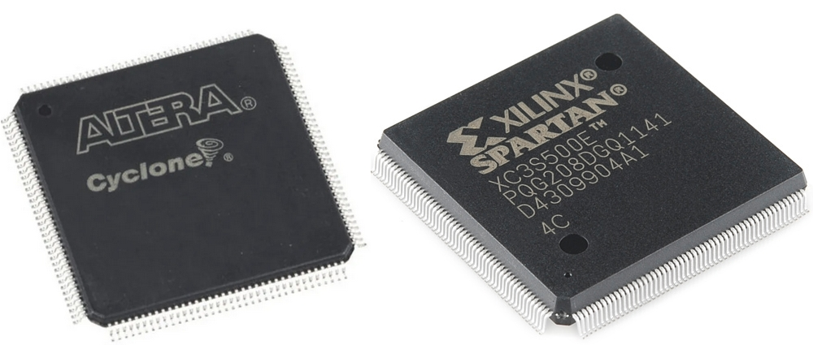
<br>
<figcaption>Fuente: https://architecnologia.es/nucleos-licencias-hardware</figcaption>
</div>

<h3>Arquitectura del FPGA</h3>

Arquitectura interna de un FPGA: LUTs (Look-Up Tables), flip-flops, bloques DSP, etc.

- Bloques Lógicos Configurables (CLBs): Contienen los elementos lógicos básicos (BLEs), tales como Look-Up Tables (LUTs) de 4 entradas, flip flops (FF) e multiplexadores, donde las LUTs son tablas de verdad de las compuestas booleanas y de las combinaciones entre estas; dichos elementos lógicos son utilizados de acuerdo a las instrucciones de la descripción del programa (Verilog y VHDL).

- Puertos de entradas y salidas (I/O): Son los pines de conexión de la FPGA con el exterior, donde se pueden conectar señales digitales y/o análogas de sensores y actuadores.

- Interconexiones programables: Son las que permiten conectar dos o más CLBs para crear funciones más complejas a través de los bloques de conexión (CBs) y los bloques de conmutación (SW), los cuales son compuestos por transistores.

<div align="center">
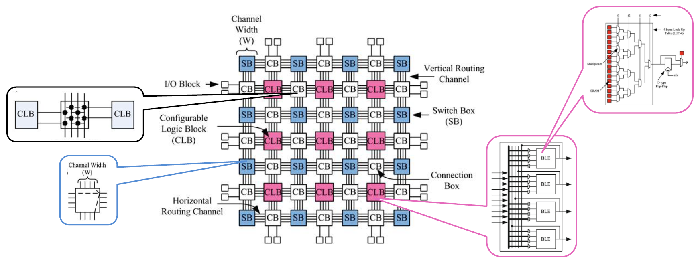
<br>
<figcaption>Fuente: http://repositorio.unb.br/handle/10482/32669</figcaption>
</div>

<h3>Flujo de proyecto en FPGA</h3>

<div align="center">
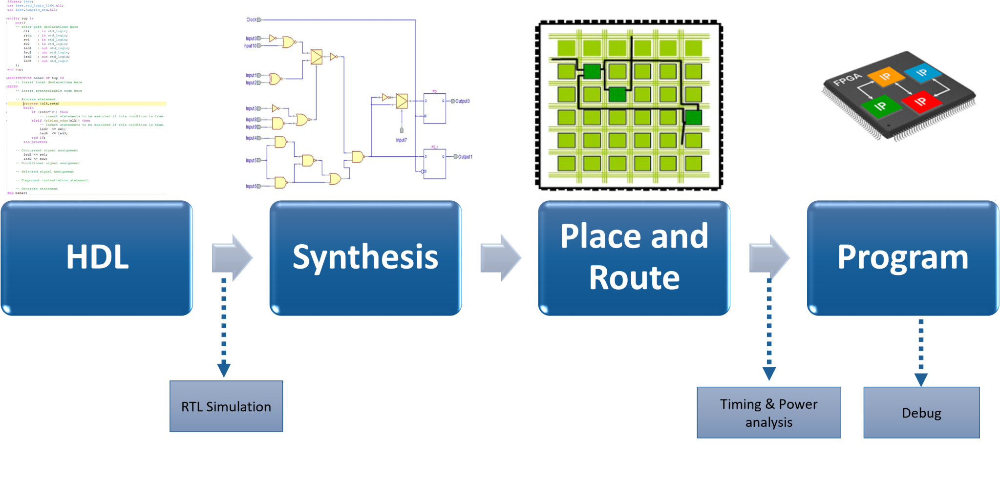
<br>
<figcaption>Fuente: https://www.my-boardclub.com/how-mcu-users-can-benefit-from-exploring-the-scope-to-use-a-low-end-fpga/</figcaption>
</div>

<h3>FPGA Altera Cyclone IV EP4CE6E22C8</h3>

El chip del FPGA Altera Cyclone IV EP4CE6E22C8 es de montaje superficial de paquete QFP de 144 pines
Tiene un procesador NIOS II
La documentación de este FPGA puede ser encontrada <a href="https://www.intel.com/content/www/us/en/docs/programmable/767845/current/cyclone-iv-featured-documentation-quick.html">aquí</a>

<div align="center">
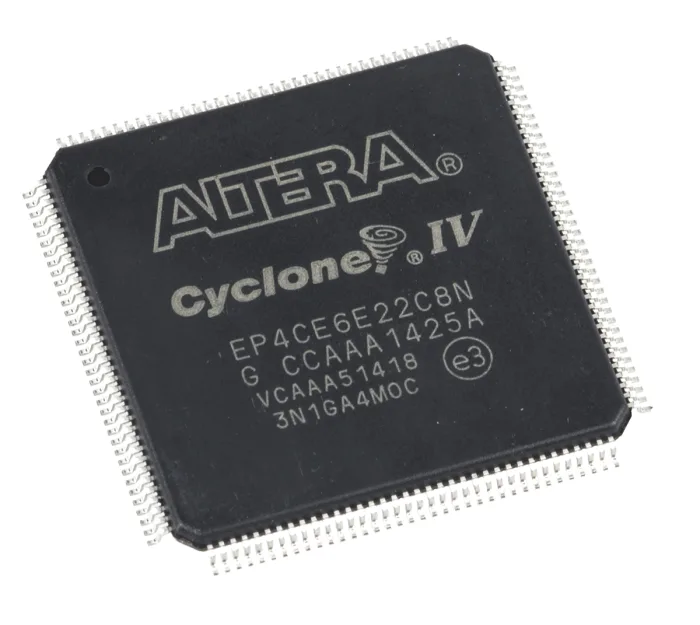
<br>
<figcaption>Fuente: https://www.vemeko.com/cyclone-iv-gx-fpga/</figcaption>
</div>


<div align="center">
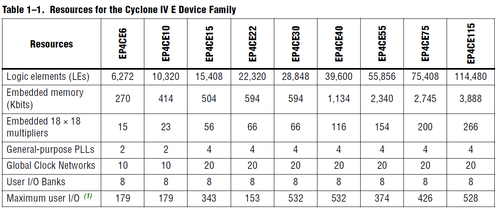
<br>
<figcaption>Fuente: Device Handbook Vol. 1</figcaption>
</div>


<div align="center">
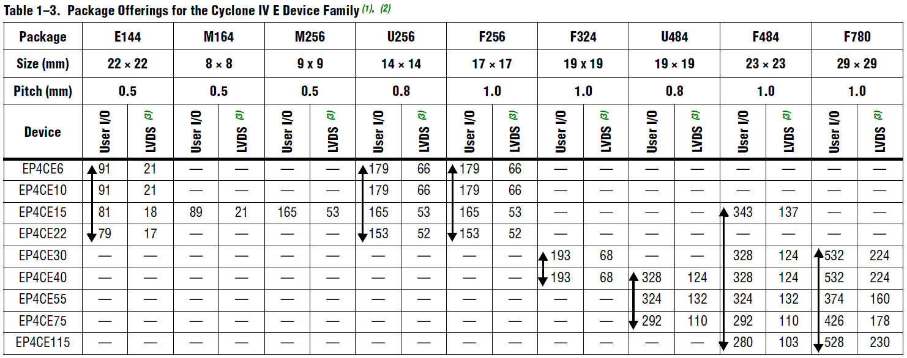
<br>
<figcaption>Fuente: Device Handbook Vol. 1</figcaption>
</div>

<h2>Diferencias entre FPGA, ASIC y microcontroladores</h2>

<div align="center">
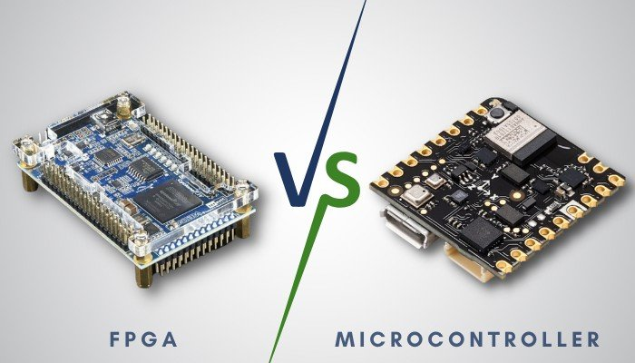
<br>
<figcaption>Fuente: https://www.ipcb.com/es/pcb-blog/10125.html</figcaption>
</div>

<div align="center">
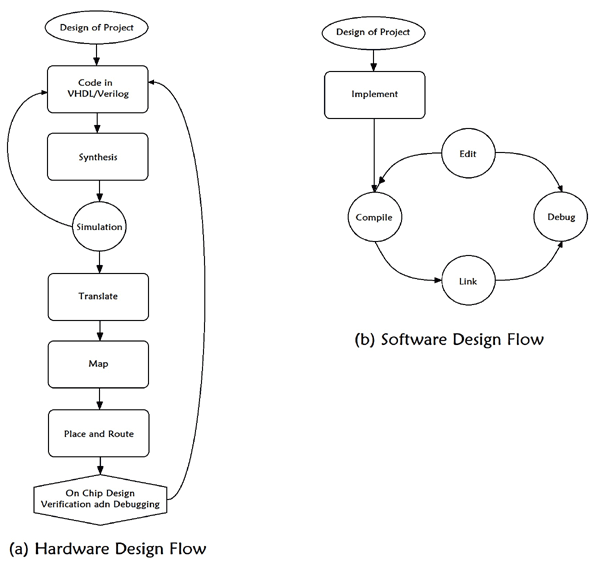
<br>
<figcaption>Fuente: https://circuitdigest.com/tutorial/what-is-fpga-introduction-and-programming-tools</figcaption>
</div>


<h2>Tarjeta de desarrollo</h2>

La tarjeta de desarrollo integra FPGA y periféricos

El chip de configuración serial es EPCS16N, para descargar y depurar el código del programa a través de JTAG.

<div align="center">
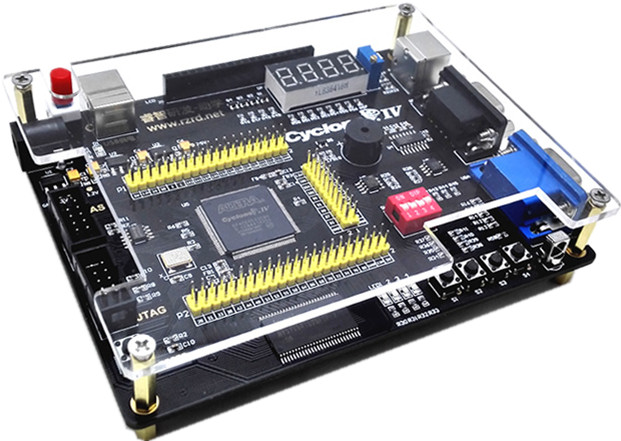
<br>
<figcaption>Fuente: https://fpga.redliquid.pl</figcaption>
</div>

<div align="center">
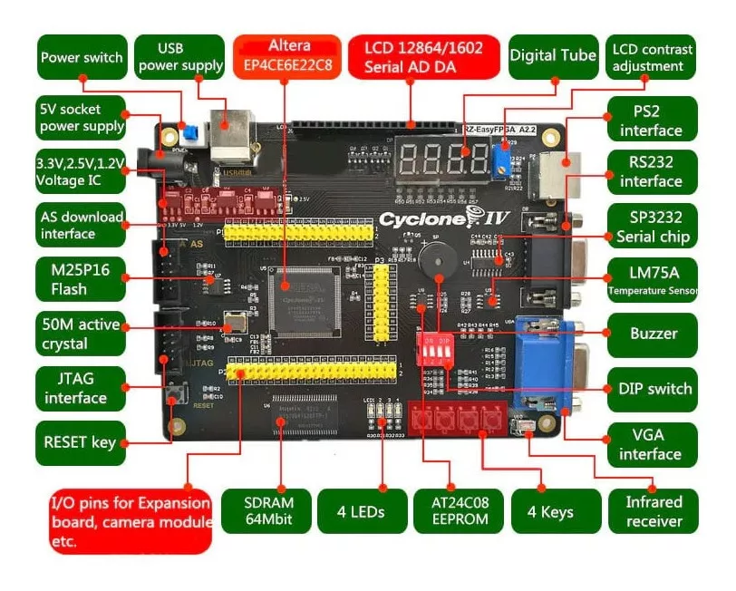
<br>
<figcaption>Fuente: https://store.roboticsbd.com/development-boards/1827-altera-cyclone-iv-ep4ce6-fpga-development-board-niosii-ep4ce-pcb-and-usb-blaster-jtag-as-programmer-robotics-bangladesh.html</figcaption>
</div>

<h2>Programador USB Blaster</h2>

El programador USB Blaster es utilizado para transferir el código del PC a la FPGA a través de Comunicación JTAG, en el cual se realiza una transferencia más rápida y requiere un archivo .SOF.

<div align="center">
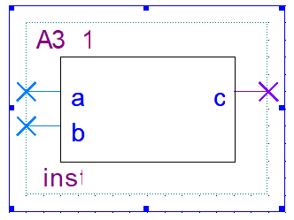
<br>
<figcaption>Fuente: https://www.intel.com/content/www/us/en/docs/programmable/683076/current/connecting-the-to-the-board.html</figcaption>
</div>

<h2>VHDL</h2>

VHDL es un lenguaje de descripción de hardware a través del cual se describe (modela) la estructura y el comportamiento de circuitos digitales ejecutados en paralelo e impulsados por eventos (clock). VHDL corresponde a la mezcla entre VHSIC (Very High Speed Integrated Circuit) y HDL (Hardware Description Language).

<h3>Tipos de datos</h3>

time

<h4>Paquete standard de la biblioteca std</h4>
- bit: representa un estado lógico de '0' o '1' y se pueden realizar operaciones lógicas y de comparación.
- integer: representa un valor entero en el rango de $-2^{32}$ a $2^{32}-1$ y se pueden realizar operaciones aritméticas y de comparación.

<h4>paquete std_logic_1164 de la biblioteca IEEE</h4>
- std_logic: representa diferentes estados lógicos, U, X, 0, 1, Z, W, L, H, -.
- std_logic_vector: es vector de bits en el que cada bit representa un estado lógico.

<h4>Paquete numeric_std de la biblioteca IEEE</h4>
signed y unsigned

<h4>Paquete fixed_pkg y float_pkg de la biblioteca </h4>
punto fijo y flotante

<div align="center">
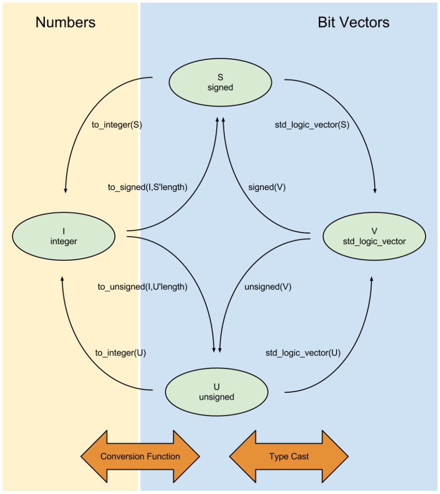
<br>
<figcaption>Fuente: https://blog.csdn.net/weixin_30723433/article/details/95658653</figcaption>
</div>

<h3>Asignación</h3>

La asignación de valores para constantes y variables es realizada a través del simbolo ':=', las cuales ocurren inmediatamente, independientemente del tiempo, y para puertos de entrada, salida y bidireccionales, al igual que para señales, la asignación es hecha por medio del simbolo '<=', las cuales ocurren en el siguiente cambio de tiempo (sentencia WAIT o fin de sentencia concurrente).

* La inicialización de constantes, variables y señales se realiza a través del simbolo ':='.

<h3>Constantes</h3>

Las constantes mantienen el valor inicializado del tipo de dato declarado durante toda la ejecución del código. Se declaran dentro de la arquitectura, pero antes del 'BEGIN'. La sintaxis es la siguiente:

```vhdl
CONSTANT constante1 : integer := 4;
CONSTANT constante2 : std_logic := `1' ‘1';
CONSTANT constante3 : time := 10 ns;
```

<h3>Variables</h3>

Las variables guardan un valor del tipo de dato declarado y pueden ser modificadas a lo largo de la ejecución del código. Si no se inicializa, toma por defecto el menor valor del tipo de dato declarado. Se declaran dentro de los procesos o subprogramas, aunque con el comando SHARED pueden ser compatidas dentro de toda la arquitectura (no recomendable), pero antes del 'BEGIN'. La sintaxis es la siguiente:

```vhdl
VARIABLE variable1 : integer := 0;
VARIABLE variable2 : std_logic := `1' ‘1';
VARIABLE variable3 : bit := 1;
```

<h3>Señales</h3>

Las señales representan conexiones física (cables) que interconectan componentes dentro de una arquitectura y entidades a través de un mapeo de puertos. Las señales guardan valores que pueden cambiar. Si no se inicializan las señales, por defecto se asigna el estado 'U'. Se declaran en sentencias concurrentes, pero antes del 'BEGIN'. La sintaxis es la siguiente:

```vhdl
SIGNAL signal1 : integer := 0;
SIGNAL signal2 : std_logic := `1' ‘1';
SIGNAL signal3 : bit := 1;
```

<h3>Sentencias concurrentes</h3>

Las sentencias concurrentes se ejecutan de manera simultanea (paralelo), por lo que no tienen prioridades en la ejecución. 

<h4>Procesos</h4>

Los procesos se ejecutan en paralelo, sin embargo, el código dentro de cada proceso es ejecutado de manera secuencial

<h4>Bloques</h4>

<h4>when-else</h4>

<h4>with-select</h4>


<h3>Sentencias secuenciales</h3>

<h4>wait</h4>

<h4>Condicionales</h4>

<h5>if else</h5>

<h5>Case-when<h5>

<h5>For-loop</h5>

<h5>While</h5>

<h5>Loop</h5>

<h5>Exit</h5>

<h5>Next</h5>

<h5>Null</h5>


<h3>Bibliotecas</h3>

Las librerías o bibliotecas son códigos utilizados frecuentemente, las cuales pueden ser reutilizadas en todos los proyectos. La sintaxis es la siguiente:

```vhdl
LIBRARY library_name;
USE library_name.package_name.package_parts;
```

 Hay tres librerías muy utilizadas en VHDL:

1. IEEE: específica sistemas lógicos multinivel (indispensable) y proporciona tipos de datos estándarizados
2. std: recurso de librería para ambiente de diseño de VHDL
3. work: usado para guardar el proyecto y el archivo del programa .vhd 

```vhdl
LIBRARY IEEE;
USE IEEE.STD_LOGIC_1164.all;
```
<h3>Entidad</h3>

La entidad es la estructura del bloque, en donde se declaran los puertos de entrada y salida. La sintaxis es la siguiente:

```vhdl
ENTITY entity_name IS
    PORT(
        port1_name : port_mode port_type;
        port2_name : port_mode port_type;
        ...
        portn_name : port_mode port_type;
    );
END entity_name;
```

<div align="center">
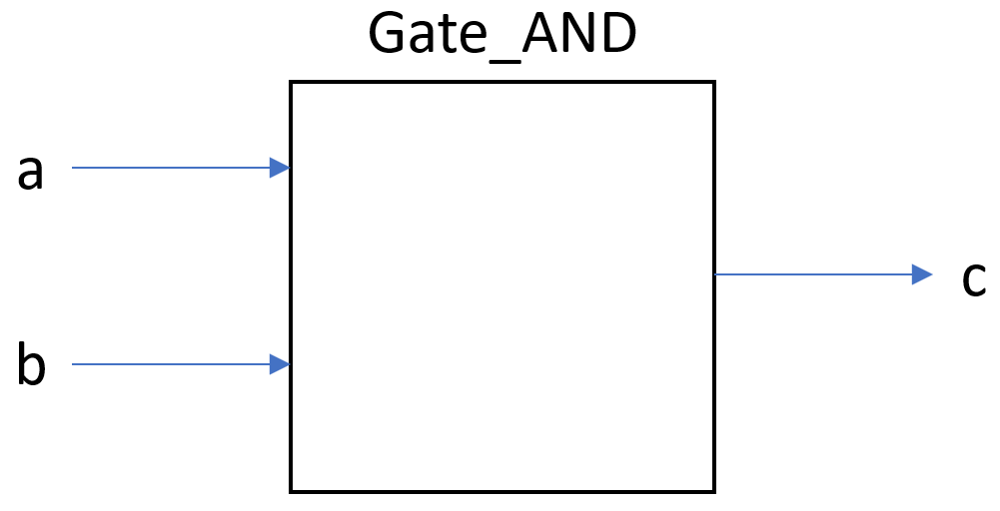
<br>
<figcaption>Fuente: Autor</figcaption>
</div>

```vhdl
ENTITY Gate_AND IS
    PORT(a,b : IN std_logic;
        c : OUT std_logic
    );
END Gate_AND;
```

<h3>Arquitectura</h3>

La arquitectura describe el comportamiento de la entidad. La sintaxis es la siguiente:

```vhdl
ARCHITECTURE architecture_name OF entity_name IS
    declarations
    BEGIN
        code ...
END architecture_name;
```

<div align="center">
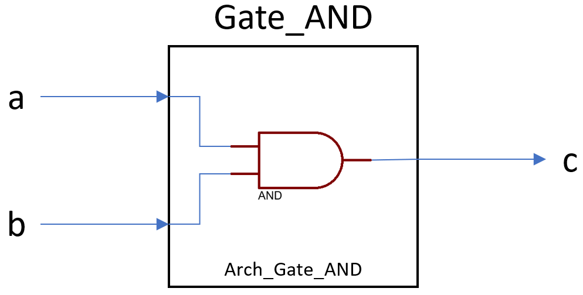
<br>
<figcaption>Fuente: Autor</figcaption>
</div>

```vhdl
ARCHITECTURE arch_Gate_AND OF Gate_AND IS
    BEGIN
        c <= a AND b;
END arch_Gate_AND;
```


behavioral
concurrente


Un código en VHDL se caracteriza por dos partes fundamentales: 1. Entidad y 2. Arquitectura. La sintaxis de un modelado en VHDL de un circuito digital está estructurado de la siguiente manera:

```vhdl
LIBRARY library_name;
USE library_name.package_name.package_parts;

ENTITY entity_name IS
    PORT(
        port1_name : port_mode port_type;
        port2_name : port_mode port_type;
        ...
        portn_name : port_mode port_type;
    );
END entity_name;

ARCHITECTURE architecture_name OF entity_name IS
    constants and signals declarations
    BEGIN
        code ...
END architecture_name;
```

<h3>Ejemplo 1</h3>

Modelar a través de VHDL el comportamiento de una compuerta AND.

```vhdl
LIBRARY IEEE;
USE IEEE.STD_LOGIC_1164.all;

ENTITY Gate_AND IS
    PORT(a,b : IN std_logic;
        c : OUT std_logic
    );
END Gate_AND;

ARCHITECTURE arch_Gate_AND OF Gate_AND IS
    BEGIN
        c <= a AND b;
END arch_Gate_AND;
```

<h2>Test bench</h2>

El Test bench es utilizado para realizar la simulación RTL en simuladores como ModelSim y así observar, depurar y analizar el comportamiento de los puertos y de las señales internas del programa en VHDL.

