<h1>Aula 3</h1>

Esta clase consiste en presentar una introducción a FPGA y a VHDL

<h2>FPGA</h2>

Un FPGA es un arreglo de compuertas programables en campo, es decir, es una arquitectura reconfigurable matricial de elementos lógicos que integra principalmente tres componentes: 1. Bloques Lógicos Configurables (CLBs), 2. Puertos de entradas y salidas (I/O) e 3. Interconexiones programables. El FPGA es programado a través de Lenguajes de Descripción de Hardware (HDL), tales como: Verilog y VHDL. Así mismo, se utilizan softwares como Vivado (Xilinx) y Quartus (Altera) como IDEs para la compilación y programación.

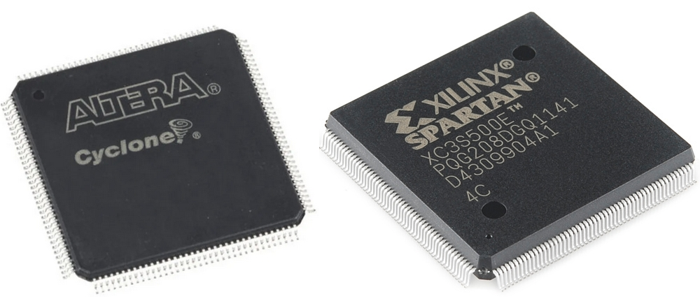
 
<figcaption>Fuente: https://architecnologia.es/nucleos-licencias-hardware</figcaption>

<h3>Arquitectura del FPGA</h3>

Arquitectura interna de un FPGA: LUTs (Look-Up Tables), flip-flops, bloques DSP, etc.

- Bloques Lógicos Configurables (CLBs): Contienen los elementos lógicos básicos (BLEs), tales como Look-Up Tables (LUTs) de 4 entradas, flip flops (FF) e multiplexadores, donde las LUTs son tablas de verdad de las compuestas booleanas y de las combinaciones entre estas; dichos elementos lógicos son utilizados de acuerdo a las instrucciones de la descripción del programa (Verilog y VHDL).

- Puertos de entradas y salidas (I/O): Son los pines de conexión de la FPGA con el exterior, donde se pueden conectar señales digitales y/o análogas de sensores y actuadores.

- Interconexiones programables: Son las que permiten conectar dos o más CLBs para crear funciones más complejas a través de los bloques de conexión (CBs) y los bloques de conmutación (SW), los cuales son compuestos por transistores.

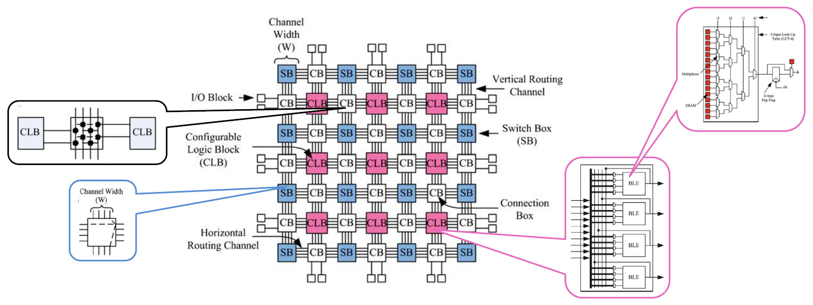
 
<figcaption>Fuente: http://repositorio.unb.br/handle/10482/32669</figcaption>

<h3>Flujo de proyecto en FPGA</h3>

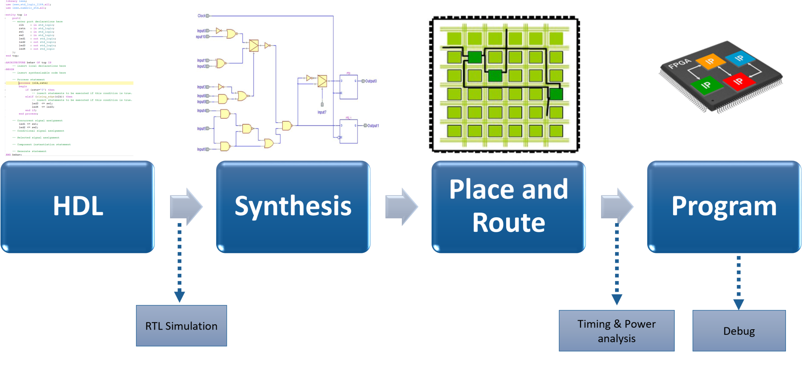
 
<figcaption>Fuente: https://www.my-boardclub.com/how-mcu-users-can-benefit-from-exploring-the-scope-to-use-a-low-end-fpga/</figcaption>

<h3>FPGA Altera Cyclone IV EP4CE6E22C8</h3>

El chip del FPGA Altera Cyclone IV EP4CE6E22C8 es de montaje superficial de paquete QFP de 144 pines
Tiene un procesador NIOS II
La documentación de este FPGA puede ser encontrada <a href="https://www.intel.com/content/www/us/en/docs/programmable/767845/current/cyclone-iv-featured-documentation-quick.html">aquí</a>

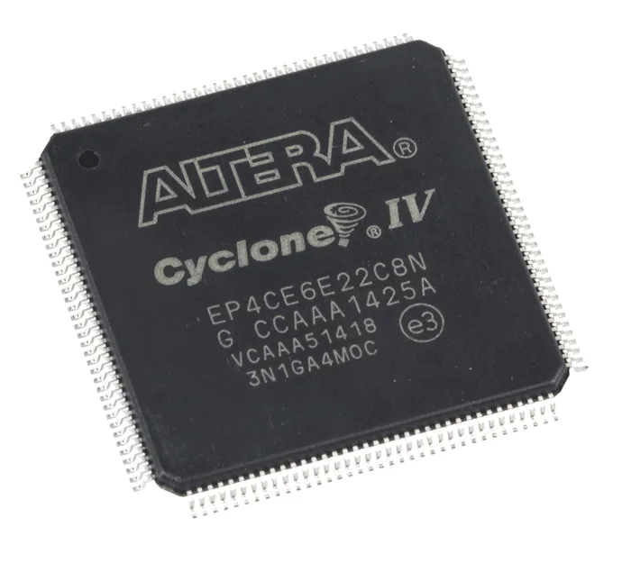
 
<figcaption>Fuente: https://www.vemeko.com/cyclone-iv-gx-fpga/</figcaption>

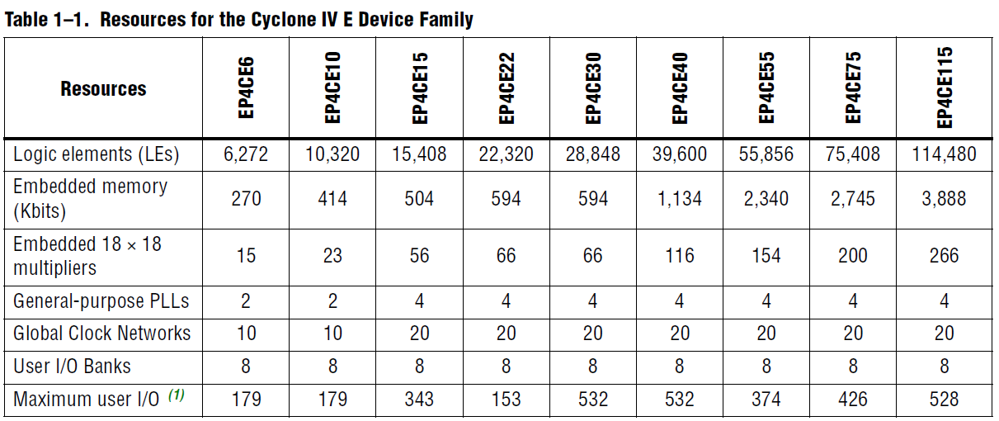
 
<figcaption>Fuente: Device Handbook Vol. 1</figcaption>

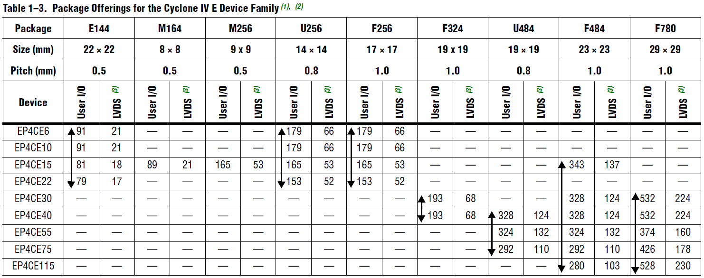
 
<figcaption>Fuente: Device Handbook Vol. 1</figcaption>

<h2>Diferencias entre FPGA, ASIC y microcontroladores</h2>

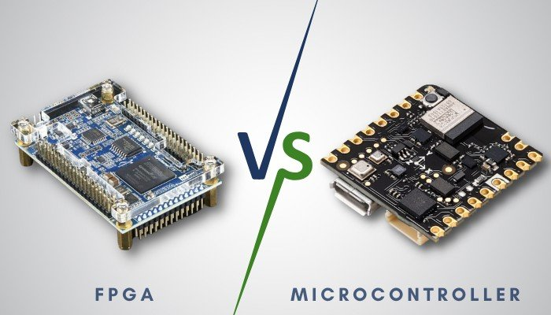
 
<figcaption>Fuente: https://www.ipcb.com/es/pcb-blog/10125.html</figcaption>

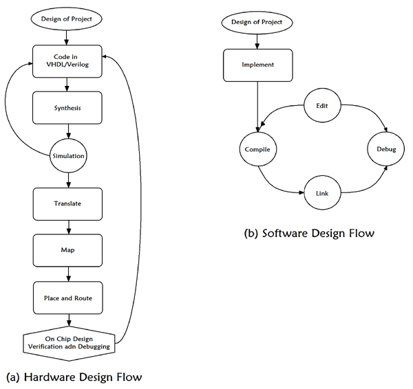
 
<figcaption>Fuente: https://circuitdigest.com/tutorial/what-is-fpga-introduction-and-programming-tools</figcaption>

<h2>Tarjeta de desarrollo</h2>

La documentación de esta tarjeta de desarrollo se encuentra <a href="https://fpga.redliquid.pl/">aquí</a> en la opción "Altera Cyclone IV board V3.0.zip". La tarjeta de desarrollo integra un FPGA Cyclone IV serie EP4CE6E22C8N de Altera y las siguientes características:

- Chip de configuración serial EPCS16N de 16Mb, para descargar y depurar el código del programa a través de JTAG o AS.
- Memoria SDRAM de 64 Mb,
- SoC (NIOS II)
- Cristal 50MHz (oscilador)
- Regulador de voltaje 1117 a 3.3V para salidas de voltaje a 3.3V
- Regulador de voltaje 1117 a 1.2V para el voltaje de alimentación del FPGA
- Regulador de voltaje 1117 a 2.5V para salida de voltaje PLL
- Alimentación de 5V DC a 1A (mínimo) por medio de un conector jack y por USB (ver PDF Board Manual)
- Led indicador de alimentación
- Conexión JTAG para transferir el programa desde Quartus al FPGA a través de un archivo .SOF (alta velocidad de transferencia)
- Conexión AS para transferir el programa desde Quartus al FPGA a través de un archivo .POF

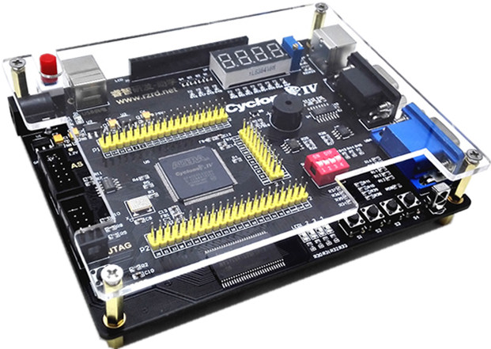
 
<figcaption>Fuente: https://fpga.redliquid.pl</figcaption>

Entre otros periféricos:

- GPIOs (# pines)
- Conexión a LCD de 20 pines (LCD1602, LCD12864, TFT LCD).
- Potenciometro de precisión para contraste ajustable de la LCD.
- VGA de 8 colores (1)
- Puerto PS2 (1)
- Puerto serial RS232 (1)
- Receptor infrarrojo (1)
- Interruptor de encendido con botón de bloqueo automático, 
- Pulsador de reinicio (1), también puede ser utilizado como pulsador de entrada
- Pulsadores (4)
- DIP switch (4 Interruptores)
- LEDs (4).
- Chicharra (1)
- Displays de 7 segmentos (4 dígitos).
- Sensor de temperatura LM754A
- Memoria EEPROM AT24C08 con I2C

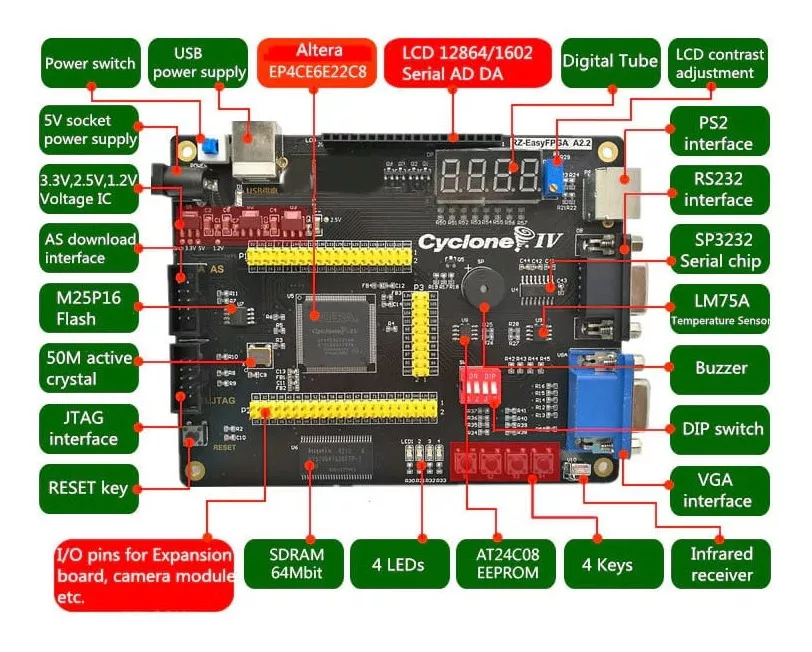
 
<figcaption>Fuente: https://store.roboticsbd.com/development-boards/1827-altera-cyclone-iv-ep4ce6-fpga-development-board-niosii-ep4ce-pcb-and-usb-blaster-jtag-as-programmer-robotics-bangladesh.html</figcaption>

El voltaje de alimentación de la tarjeta de desarrollo 

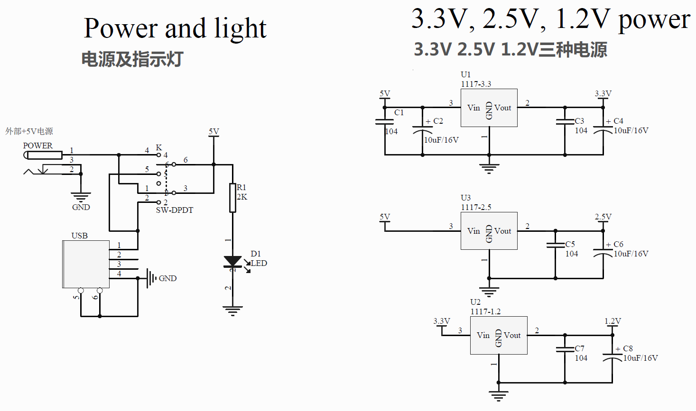
 
<figcaption>Fuente: Development board schematic diagram V2.1</figcaption>

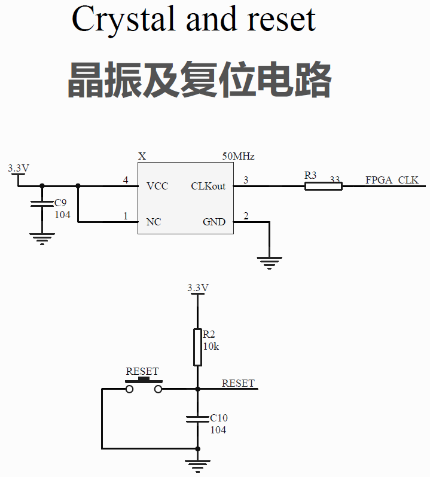
 
<figcaption>Fuente: Development board schematic diagram V2.1</figcaption>

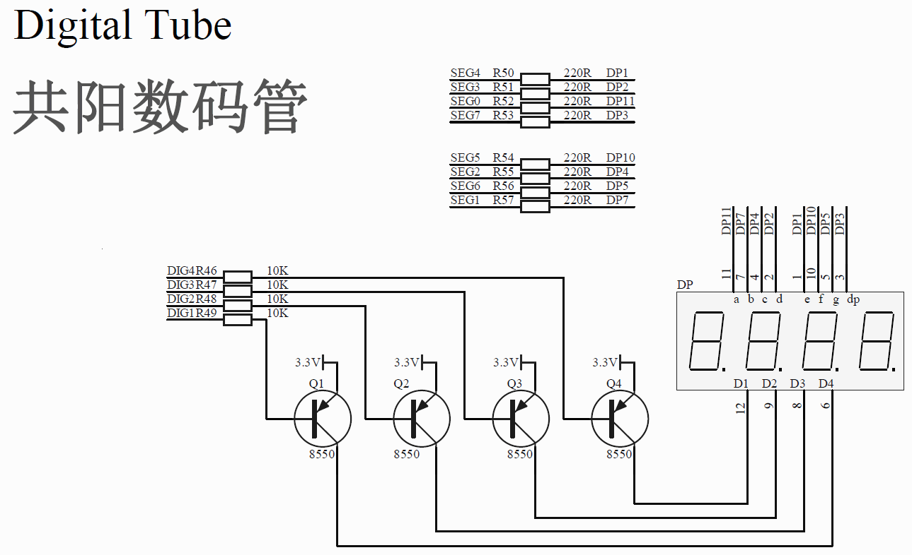
 
<figcaption>Fuente: Development board schematic diagram V2.1</figcaption>

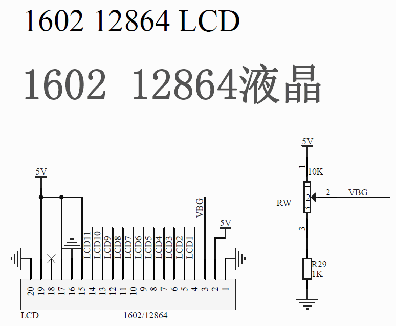
 
<figcaption>Fuente: Development board schematic diagram V2.1</figcaption>

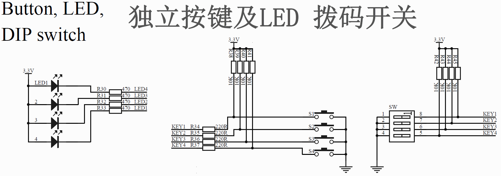
 
<figcaption>Fuente: Development board schematic diagram V2.1</figcaption>

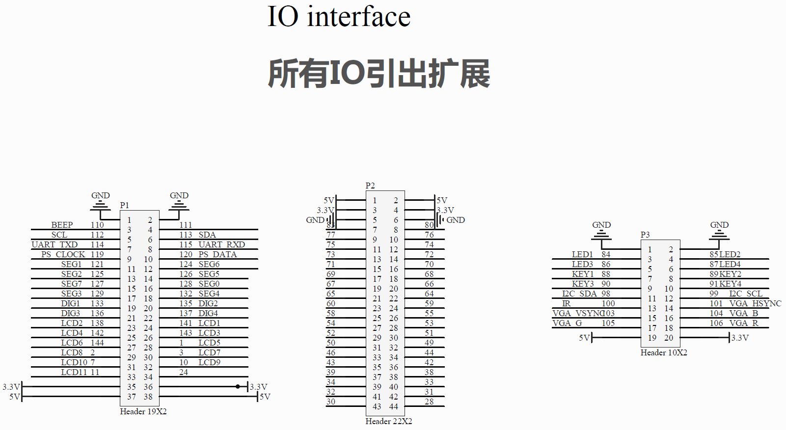
 
<figcaption>Fuente: Development board schematic diagram V2.1</figcaption>

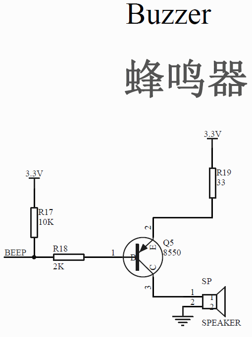
 
<figcaption>Fuente: Development board schematic diagram V2.1</figcaption>

Los esquemáticos de RS232, VGA, infrarrojo, PS2, EEPROM AT24C08, sensor de temperatura, entre otros, están en la documentación: "Development board schematic diagram V2.1".

<h2>Programador USB Blaster</h2>

El programador USB Blaster es utilizado para transferir el código del PC a la FPGA a través de Comunicación JTAG, en el cual se realiza una transferencia más rápida y requiere un archivo .SOF.

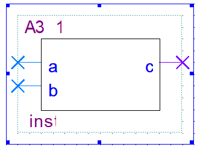
 
<figcaption>Fuente: https://www.intel.com/content/www/us/en/docs/programmable/683076/current/connecting-the-to-the-board.html</figcaption>

