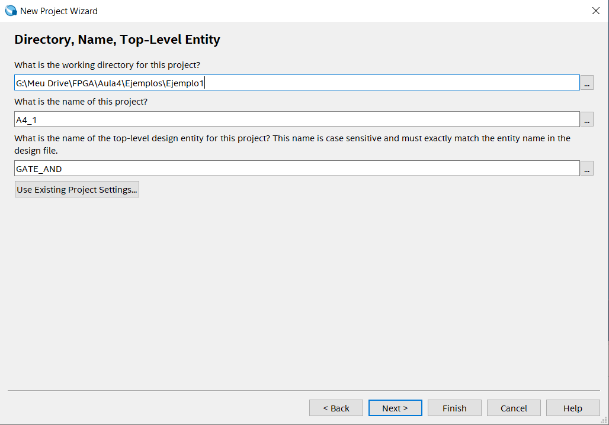
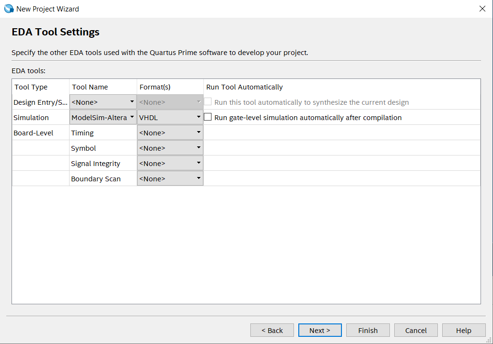
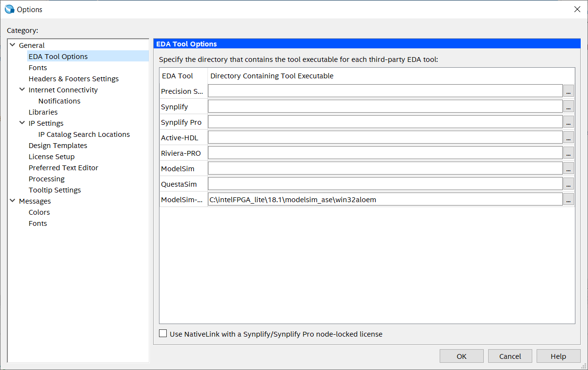
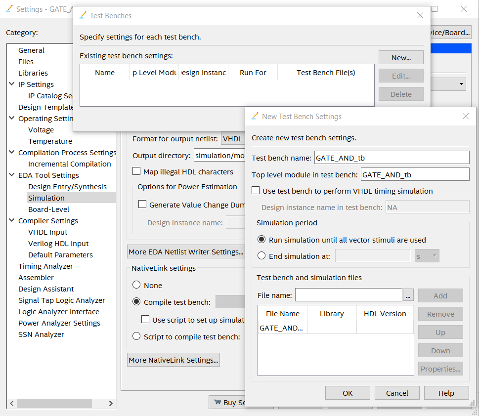
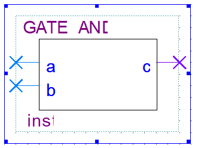

Cómo diseñar módulos básicos en HDL.

Simulación y verificación: Pruebas de diseño.

Programación de la FPGA con herramientas específicas.


Descargar Intel® Quartus® Prime Lite Edition v18.1 para Windows <a href="https://www.intel.com/content/www/us/en/collections/products/fpga/software/downloads.html">aquí</a> y posteriormente descargar los siguientes <i>softwares</i>:

1. Intel® Cyclone® IV Device Support
2. ModelSim-Intel® FPGA Edition (includes Starter Edition)
3. Intel® Quartus® Prime (includes Nios® II EDS)

Posteriormente, ejecutar el instalador de Intel® Quartus® Prime donde el asistente de instalación reconoce el dispositivo (Cyclone IV) y el simulador (ModelSim) para ser instalados al mismo tiempo.

El proyecto puede tener un nombre diferente a la entidad de más alto nivel


!

En la última parte de la creación del proyecto se debe seleccionar ModelSim-Altera y VHDL en la opción Simulation



Después de crear un proyecto nuevo, se debe configurar el ejecutable de la herramienta de simulación en ModelSim-Altera en la opciones > EDA Tool Options



Posteriormente, se debe crear un archivo VHDL File, en el cual el nombre de la entidad debe tener el mismo nombre del archivo .vhd y se debe compilar en la opción Start Analysis & Synthesis para verificar que el código no tenga errores. 

```vhdl
LIBRARY IEEE;
USE IEEE.STD_LOGIC_1164.all;

ENTITY GATE_AND IS
    PORT(a,b : IN std_logic;
          c : OUT std_logic
    );	  
END GATE_AND;

ARCHITECTURE GATE_AND_arch OF GATE_AND IS
    BEGIN
    c <= (a AND b);
END GATE_AND_arch;
```

Dar click en la opción Start Compilation para generar la plantilla test bench, la cual se encuentra en la carpeta simulation dentro de la ruta del proyecto y allí se encontrarár el archivo test bench (.vht), el cual se debe generar accesando a la opción Processing > Start > Start Test Bench Template Writer, y posteriormente se debe crear una copia de dicho archivo y pegarla en la ruta inicial del proyecto y cambiarle el nombre (ej: GATE_AND_tb.vht), para así finalmente agregar ese archivo en el proyecto en Quartus y editarlo con respecto al nombre de la entidad y de la arquitectura (ej: GATE_AND_tb y GATE_AND_tb_arch), los valores de las señales tanto iniciales como durante el proceso always y los tiempos de espera de las señales (delays).

```vhdl
-- Generated on "04/03/2025 21:07:16"
                                                            
-- Vhdl Test Bench template for design  :  GATE_AND
-- 
-- Simulation tool : ModelSim-Altera (VHDL)
-- 

LIBRARY ieee;                                               
USE ieee.std_logic_1164.all;                                

ENTITY GATE_AND_vhd_tst IS
END GATE_AND_vhd_tst;

ARCHITECTURE GATE_AND_arch OF GATE_AND_vhd_tst IS
	-- constants                                                 
	-- signals                                                   
	SIGNAL a : STD_LOGIC := '0';
	SIGNAL b : STD_LOGIC := '0';
	SIGNAL c : STD_LOGIC := '0';
	
	COMPONENT GATE_AND
		PORT (
			a : IN STD_LOGIC;
			b : IN STD_LOGIC;
			c : BUFFER STD_LOGIC
		);
	END COMPONENT;
	
	BEGIN
	
	i1 : GATE_AND
	PORT MAP (
-- list connections between master ports and signals
		a => a,
		b => b,
		c => c
	);
		
	init : PROCESS                                               
	-- variable declarations                                     
	BEGIN                                                        
			  -- code that executes only once                      
	WAIT;                                                       
	END PROCESS init;
	
	always : PROCESS                                              
	-- optional sensitivity list                                  
	-- (        )                                                 
	-- variable declarations                                      
	BEGIN                                                         
			  -- code executes for every event on sensitivity list  
	a <= '0'; b <= '0';
	WAIT FOR 10ns; 
	a <= '0'; b <= '1';
	WAIT FOR 10ns;   
	a <= '1'; b <= '0';
	WAIT FOR 10ns; 
	a <= '1'; b <= '1';
	WAIT FOR 10ns;      

	END PROCESS always; 
	
END GATE_AND_arch;
```

Agregar el archivo test bench en las configuraciones de simulación, en la opción Compile test bench 



Dar click en la opción Start Compilation para compilar todo el proyecto y ejecutar la simulación en ModelSim en la opción Tools > Run Simulation Tool > RTL Simulation


Para crear un bloque a partir de un archivo VHDL en Quartus, puedes seguir estos pasos:

Compila tu archivo VHDL:

Asegúrate de que tu archivo VHDL esté libre de errores de sintaxis y compílalo en Quartus.

Genera el símbolo del bloque:

Ve al menú "File" y selecciona "Create/Update".

Luego, elige la opción "Create Symbol File for Current File". Esto generará un archivo de símbolo (.bsf) que representa tu diseño VHDL como un bloque.



Usa el bloque en un diseño esquemático:

Abre un archivo de diseño esquemático (.bdf) en Quartus.

Inserta el símbolo generado desde el menú de herramientas de bloques o arrástralo directamente al diseño.

Conecta el bloque:

Conecta las entradas y salidas del bloque a otros componentes en tu diseño esquemático.


Del cual se genera el código en VHDL en la opción File > Create/Update > Create HDL Design File from Current File

```vhdl
-- PROGRAM		"Quartus Prime"
-- VERSION		"Version 18.1.0 Build 625 09/12/2018 SJ Lite Edition"
-- CREATED		"Thu Apr 03 13:02:58 2025"

LIBRARY ieee;
USE ieee.std_logic_1164.all; 

LIBRARY work;

ENTITY A3_1_blocks IS 
    PORT
    (
        in1 :  IN  STD_LOGIC;
        in2 :  IN  STD_LOGIC;
        in3 :  IN  STD_LOGIC;
        in4 :  IN  STD_LOGIC;
        out1 :  OUT  STD_LOGIC
    );
END A3_1_blocks;

ARCHITECTURE bdf_type OF A3_1_blocks IS 

COMPONENT a3_1
    PORT(a : IN STD_LOGIC;
         b : IN STD_LOGIC;
         c : OUT STD_LOGIC
    );
END COMPONENT;

SIGNAL	SYNTHESIZED_WIRE_0 :  STD_LOGIC;
SIGNAL	SYNTHESIZED_WIRE_1 :  STD_LOGIC;


BEGIN 


b2v_inst : a3_1
PORT MAP(a => in1,
         b => in2,
         c => SYNTHESIZED_WIRE_0);


b2v_inst1 : a3_1
PORT MAP(a => in3,
         b => in4,
         c => SYNTHESIZED_WIRE_1);


b2v_inst2 : a3_1
PORT MAP(a => SYNTHESIZED_WIRE_0,
         b => SYNTHESIZED_WIRE_1,
         c => out1);


END bdf_type;
```

A lo que sería igual a:

```vhdl
LIBRARY IEEE;
USE IEEE.STD_LOGIC_1164.all;

ENTITY A3_1 IS
    PORT(in1,in2,in3,in4 : IN std_logic;
          out1 : OUT std_logic
    );	  
END A3_1;

ARCHITECTURE blinking OF A3_1 IS
    SIGNAL s1, s2 
    BEGIN
    s1 <= (in1 AND in2);
    s2 <= (in3 AND in4);
    out <= (s1 AND s2);
END blinking;
```