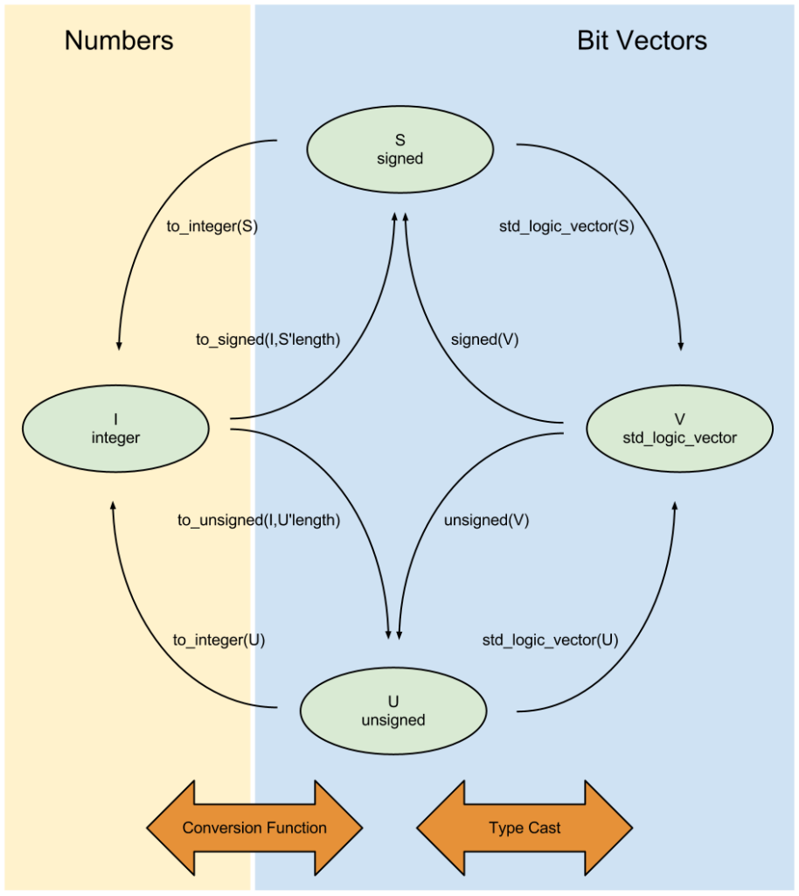
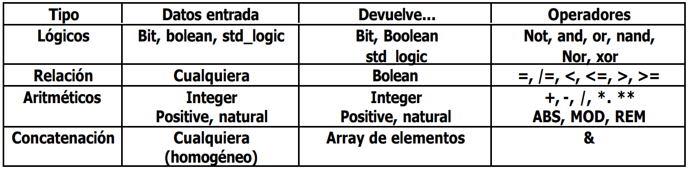
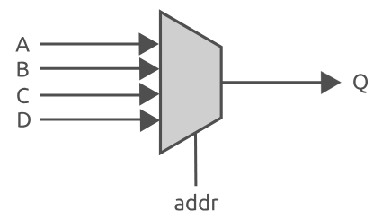
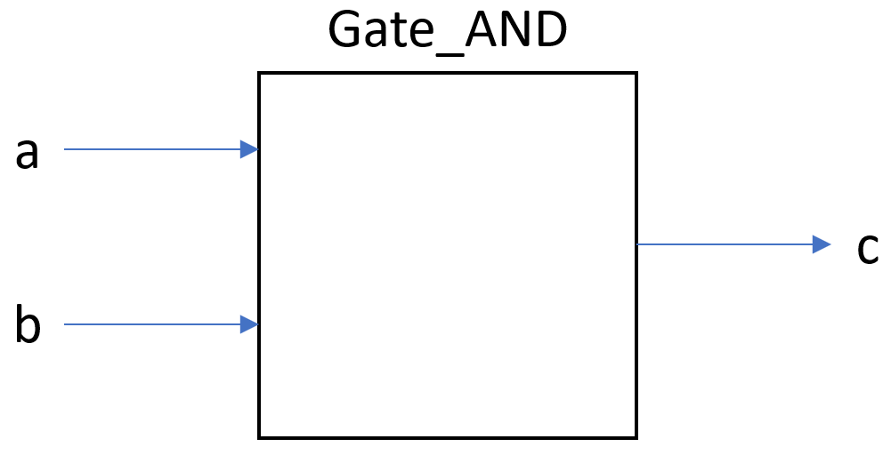
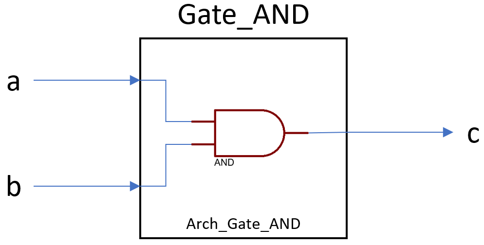

<h1>Aula 4</h1>

Esta clase consiste en realizar una introducción a VHDL en cuanto a los tipos de datos, los tipos de sentencias; además de presentar la entidad y la arquitectura para diseñar hardware.

<h2>VHDL</h2>

VHDL es un lenguaje de descripción de hardware a través del cual se describe (modela) la estructura y el comportamiento de circuitos digitales ejecutados en paralelo e impulsados por eventos o interrupciones (ej: clock, entradas digitales, etc). VHDL corresponde a la mezcla entre VHSIC (Very High Speed Integrated Circuit) y HDL (Hardware Description Language).

> [!IMPORTANT]
>En VHDL no se distigue entre las minusculas y mayusculas en las palabras.

<h3>Tipos de datos</h3>

En VHDL existen diferentes tipos de datos para almacenar bits, números enteros, punto fijo y punto flotante, que pueden ser utilizados en puertos de entrada/salida, señales, variables o constantes.

<h4>1. Paquete standard de la biblioteca std</h4>

El paquete standard en VHDL contiene los tipos de datos boolean, bit, bit_vector, integer, time, entre otros; además de operaciones lógicas y aritméticas para operar estos tipos de datos.

> [!IMPORTANT]
>Para utilizar el paquete estándar de VHDL no hay que importar ninguna librería.

<h5>boolean: representa false o true</h5>

```vhdl
flag : boolean := false;
```

<h5>bit: representa un estado lógico de '0' o '1' y se pueden realizar operaciones lógicas y de comparación.</h5>

```vhdl
a  : bit := '1';
b  : bit := '0';
```

<h5>bit_vector: representa un vector de bits en el que cada bit representa un estado lógico (ej: range 0 to 3 o range 3 downto 0) y no tiene representación numérica.</h5>

```vhdl
a : bit_vector(3 downto 0) := "1010";
```

<h5>integer: representa un valor entero con signo en el rango de 32 bits por defecto, con el cual se pueden realizar operaciones aritméticas y de comparación.</h5>

> [!IMPORTANT]
>El rango de integer es $-2^{32}$ a $2^{32}-1$. Sin embargo, es recomendable parametrizar el tamaño de números a utilizar (ej: range 0 to 255 o range 255 downto 0).

```vhdl
a : integer := 532;
b : integer := -532;
contador : integer range 0 to 100;
```

Asimismo, existen dos subtipos de datos derivados de integer y definidos por VHDL, los cuales son natural y positive.

<h5>natural: representa un numero integer para almacenar números mayores o iguales que cero.</h5>

```vhdl
a : natural := 0;
b : natural := 1;
```

<h5>positive: representa un numero integer para almacenar números mayores que cero.</h5>

```vhdl
a : positive := 4;
b : positive := 1;
```

<h5>time: representa delays.</h5>

```vhdl
t1 : time := 10 ns;
```

<h4>2. paquete std_logic_1164 de la biblioteca IEEE</h4>

El paquete std_logic_1164 permite definir nueve estados en los tipos de datos std_logic y std_logic_vector, los cuales permiten modelar el comportamiento de circuitos digitales de manera más real y detallada con respecto al comportamiento en hardware físico.

> [!IMPORTANT]
>Para utilizar el paquete std_logic_1164 de VHDL hay que importar la librería ieee y el paquete ieee.std_logic_1164.all.

<h5>std_logic: representa diferentes estados lógicos:'U': uninitialized, 'X': unknown, '0': lógica baja, '1': lógica alta, 'Z': high impedance, 'W': weak unknown, 'L': weak 0, 'H': weak 0, '-': don't care.</h5>

```vhdl
library ieee;
use ieee.std_logic_1164.all;

a : std_logic := '1';
```

<h5>std_logic_vector: representa un vector de bits en el que cada bit representa un estado lógico (ej: range 0 to 3 o range 3 downto 0) y no tiene representación numérica; por tanto, no es posible realizar operaciones aritméticas.</h5>

```vhdl
library ieee;
use ieee.std_logic_1164.all;

a : std_logic_vector(7 downto 0) := (others => '0');
```

<h4>3. Paquete numeric_std de la biblioteca IEEE</h4>

El paquete numeric_std permite definir tipos de datos de números binarios como `signed` y `unsigned`, además de operaciones aritméticas (+, -, *, ), comparaciones (=, /=, <, >, <=, >=) y desplazamientos (shift_left, shift_right, rotate_left, rotate_right).

<h5>signed</h5>

Los vectores de bits `signed` son aquellos que representan un número entero con signo, es decir, negativo y positivo, donde el MSB indica el signo, 0 es positivo y 1 es negativo. Un número entero con signo de n bits es representado desde $\frac{-2^{n}}{2}$ a $\frac{2^{n}}{2}-1$.

> [!NOTE]
> Si el MSB es 1, el número se determinar con complemento a2

```vhdl
library ieee;
use ieee.numeric_std.all;

a : signed(7 downto 0) := "11111111"; -- -1
```

<h5>unsigned</h5>

Los vectores de bits `unsigned` son aquellos que representan un número entero sin signo, es decir, solo positivo (números mayores o iguales que 0). Un número entero sin signo de n bits es representado desde $0$ a $2^{n}-1$.

```vhdl
library ieee;
use ieee.numeric_std.all;

a : unsigned(7 downto 0) := "11111111"; -- 255
```

<h4>4. Paquete fixed_pkg y float_pkg de la biblioteca IEEE</h4>

Los paquetes fixed_pkg y float_pkg permiten definir tipos de datos de números binarios con decimales fijos `signed` y `unsigned` (sfixed y ufixed) y decimales flotantes (float).

<h5>punto fijo</h5>

El tipo de dato punto fijo permite definir la cantidad de bits para la parte entera y la cantidad para la parte decimal; además, se pueden realizar operaciones aritméticas (+, -, *, /), comparaciones y conversiones.

```vhdl
library ieee;
use ieee.fixed_pkg.all;

a : sfixed(3 downto -4) := to_sfixed(1.375, a'high, a'low);  -- 4 bits enteros + 4 fraccionales
b : ufixed(2 downto -5) := to_ufixed(2.5, b'high, b'low); -- 3 bits enteros + 5 fraccionales
```

<h5>flotante</h5>

Los números de punto flotante consisten en 32 bits, los cuales tienen 1 bit de signo, 8 bits de exponente y 23 bits de mantisa de acuerdo a la norma IEEE 754; además, se pueden realizar operaciones aritméticas y conversiones desde o hacia enteros y punto fijo.

```vhdl
library ieee;
use ieee.float_pkg.all;

a : float32 := to_float(3.14, float32);
b : float64;
b <= to_float(2.718, float64);
```

<h4>Conversiones</h4>

Las conversiones entre tipos de datos en VHDL son utilizadas para cambiar la representación numérica entre enteros y vectores de bits.

<div align="center">

<br>
<figcaption>Fuente: https://blog.csdn.net/weixin_30723433/article/details/95658653</figcaption>
</div>

<h5>Conversión entre vectores de bits</h5>

A pesar de que la conversión entre vectores de bits no modifica los bits, el tipo de dato sí es modificado, lo cual es importante en VHDL para conectar un dato `signed`, `unsigned` a un dato `std_logic_vector` o viceversa; asimismo, al utilizar librerías que esperan el tipo de dato específico, ya sea `signed`, `unsigned` o `std_logic_vector`.

> [!NOTE]
> Hay que tener el dato en `std_logic_vector` para manejar buses, registros o puertos y para concatenar bits \
> Hay que tener el dato en `signed` o `unsigned` para operar aritméticamente 

<h6>std_logic_vector y unsigned</h6>

```vhdl
library ieee;
use ieee.std_logic_1164.all;
use ieee.numeric_std.all;

a : std_logic_vector(3 downto 0) := "1010";
b : unsigned(3 downto 0);
c : signed(3 downto 0);

b <= unsigned(a);  -- Ahora es un vector de bits que representa 10
C_v <= std_logic_vector(A_u);  -- 


b <= unsigned(a);  -- Ahora es un vector de bits que representa 10
c <= signed(a);    -- Ahora es un vector de bits que representa -6
```

<h5>Conversión entre enteros y vectores de bits</h5>

```vhdl
library ieee;
use ieee.std_logic_1164.all;
use ieee.numeric_std.all;


```

<h4>Operaciones</h4>

<div align="center">

<br>
<figcaption>Fuente: https://www.geocities.ws/curso_tecnologia_electronica/VHDL/STX-VHDL.pdf</figcaption>
</div>

<h3>Asignación</h3>

La asignación de valores para constantes y variables es realizada a través del simbolo ':=', las cuales ocurren inmediatamente, independientemente del tiempo, y para puertos de entrada, salida y bidireccionales, al igual que para señales, la asignación es hecha por medio del simbolo '<=', las cuales ocurren en el siguiente cambio de tiempo (sentencia WAIT o fin de sentencia concurrente).

* La inicialización de constantes, variables y señales se realiza a través del simbolo ':='.

<h3>Constantes</h3>

Las constantes mantienen el valor inicializado del tipo de dato declarado durante toda la ejecución del código. Se declaran dentro de la arquitectura, pero antes del 'BEGIN'. La sintaxis es la siguiente:

```vhdl
CONSTANT constante1 : integer := 4;
CONSTANT constante2 : std_logic := '1';
CONSTANT constante3 : time := 10 ns;
```

<h3>Variables</h3>

Las variables guardan un valor del tipo de dato declarado y pueden ser modificadas a lo largo de la ejecución del código. Si no se inicializa, toma por defecto el menor valor del tipo de dato declarado. Se declaran dentro de los procesos o subprogramas, aunque con el comando SHARED pueden ser compatidas dentro de toda la arquitectura (no recomendable), pero antes del 'BEGIN'. La sintaxis es la siguiente:

```vhdl
VARIABLE variable1 : integer := 0;
VARIABLE variable2 : std_logic := '1';
VARIABLE variable3 : bit := 1;
```

<h3>Señales</h3>

Las señales representan conexiones física (cables) que interconectan componentes dentro de una arquitectura y entidades a través de un mapeo de puertos. Las señales guardan valores que pueden cambiar. Si no se inicializan las señales, por defecto se asigna el estado 'U'. Se declaran en sentencias concurrentes, pero antes del 'BEGIN'. La sintaxis es la siguiente:

```vhdl
SIGNAL signal1 : integer := 0;
SIGNAL signal2 : std_logic := '1';
SIGNAL signal3 : bit := 1;
SIGNAL signal4 : std_logic_vector(3 to 0) := "0000";
```

<h3>Atributos</h3>

Los atributos son 

<h4>Event</h4>

Los eventos son únicamente de señales y retornan 'true' en el momento que se cumple la condición de la señal; por ejemplo: event(clk='1' and clk'event), retorna 'true' cuando hay un flanco de subida en la señal clk.

<h4>Range</h4>

Range son únicamente para vectores y retorna el rango del vector; por ejemplo: signal wire1: std_logic_vector (7 downto 0), en 'for i in wire1 range loop' es igual a 'for i in 7 downto 0 loop'.

<h3>Sentencias concurrentes</h3>

Las sentencias concurrentes son únicamente para las señales y se ejecutan de manera asíncrona y simultanea (paralelo), por lo que no tienen prioridades en la ejecución. Estas sentencias modelan circuitos digitales de lógica combinacional (ej: compuertas lógicas).

<h3>Procesos</h3>

Los procesos se ejecutan en paralelo, sin embargo, el código dentro de cada proceso es ejecutado de manera secuencial. La sintaxis es la siguiente:

```vhdl
PROCESS(lista sensitiva)
	sentencias locales (constantes, variables y subprogramas)
	BEGIN
		sentencias secuenciales
END PROCESS;
```

<h4>with-select</h4>

La sintaxis es la siguiente:

```vhdl
WITH signal_condition SELECT
signal5 <= signal1 WHEN value1,
		   signal2 WHEN value2,
		   signal3 WHEN value3,
		   ...
		   signaln WHEN OTHERS;

```

* Para evitar latchs se debe colocar la sentencia WHEN OTHERS para la última combinación de las señales de selección.

<div align="center">

<br>
<figcaption>Fuente: https://fpgatutorial.com/vhdl-logical-operators-and-signal-assignments-for-combinatorial-logic/</figcaption>
</div>

```vhdl
WITH addr SELECT
Q <= A when "00",
	 B when "01",
	 C when "10",
	 D WHEN OTHERS;
```

<h4>when-else</h4>

La sintaxis es la siguiente:

```vhdl
signal5 <= signal1 WHEN condition1 ELSE
		   signal2 WHEN condition2 ELSE
		   signal3 WHEN condition3 ELSE
		   ...
		   signaln;
```

* Para evitar un latch (no recomendable) se debe contemplar la última condición ELSE

<div align="center">

<br>
<figcaption>Fuente: https://fpgatutorial.com/vhdl-logical-operators-and-signal-assignments-for-combinatorial-logic/</figcaption>
</div>

```VHDL
Q <= A WHEN addr = "00" ELSE 
	 B WHEN addr = "01" ELSE
	 C WHEN addr = "10" ELSE
	 D;
```

<h3>Sentencias secuenciales</h3>

Las sentencias secuenciales se ejecutan dentro de procesos funciones o procedimientos. Estas sentencias modelan circuitos digitales de lógica secuencial (ej: flip-flops).

<h5>IF THEN</h5>

La sintaxis es la siguiente:

```vhdl
IF condition1 THEN
	sentence1;
ELSIF condition2 THEN
	sentence2;
...
ELSIF conditionn THEN
	sentencen;
ELSE
	sentencex;
END IF;
```

* Para evitar un latch (no recomendable) se debe contemplar la condición ELSE o definir un valor inicial antes del IF de la variable de salida

```vhdl
IF rising_edge(clock) THEN
	q <= d;
end if;
```
Revisar este ejemplo

<h5>case-when</h5>

La sintaxis es la siguiente:

```vhdl
CASE expresion IS
	WHEN value1 => sentence1;
	WHEN value2 => sentence2;
	WHEN value3 => sentence3;
	...
	WHEN valuen => sentencen;
END CASE;
```

<h5>for-loop</h5>

La sintaxis es la siguiente:

```vhdl
FOR index IN range LOOP
	sentences
END LOOP;
```

* El índice de los bucles 'for' no se debe declarar

<h5>While</h5>

<h5>Loop</h5>

<h3>Procedimientos</h3>

La sintaxis es la siguiente:

```vhdl
PROCEDURE procedure_name (parameters) IS
	statements
	BEGIN
		sentencias secuenciales
END PROCEDURE;
``` 

<h3>Funciones</h3>

La sintaxis es la siguiente:

```vhdl
FUNCTION nombre_funcion (parámetros) RETURN tipo IS
	declaraciones
	BEGIN
		sentencias secuenciales
		RETURN valor;
END FUNCTION;
```

<h3>Sentencias estructurales</h3>

<h4>COMPONENT</h4>

Se declara dentro de la arquitectura, pero antes del 'BEGIN', sin embargo, el mapeamiento del componente se realiza después del 'BEGIN'. La sintaxis es la siguiente:

```vhdl
COMPONENT nombre_componente
	PORT(
		señal1 : modo tipo;
		señal2 : modo tipo;
		señal3 : modo tipo;
		...
		señalN : modo tipo;
	)
END COMPONENT;
BEGIN 
	nombre_copia_componente : nombre_componente
	PORT MAP(
		puerto1 => señal1,
		puerto2 => señal2,
		puerto3 => señal3,
		...
		puertoN => señalN
	);
```

<h3>Sentencias de espera</h3>

<h4>AFTER</h4>

Se puede ejecutar en sentencias concurrentes o secuenciales. La sintaxis es la siguiente:

```vhdl
señal <= valor1 AFTER tiempo1 ns,
		 valor2 AFTER tiempo2 ns,
		 valor3 AFTER tiempo3 ns,
		 ...
		 valorN AFTER tiempoN ns,
```

<h4>WAIT</h4>

Se puede ejecutar únicamente en sentencias secuenciales. La sintaxis es la siguiente:

```vhdl
WAIT FOR tiempo ns;
WAIT UNTIL condición;
WAIT ON lista de sensibilidad;
```

<h5>Exit</h5>

<h5>Next</h5>

<h5>Null</h5>


<h3>Bibliotecas</h3>

Las librerías o bibliotecas son códigos utilizados frecuentemente, las cuales pueden ser reutilizadas en todos los proyectos. La sintaxis es la siguiente:

```vhdl
LIBRARY library_name;
USE library_name.package_name.package_parts;
```

 Hay tres librerías muy utilizadas en VHDL:

1. IEEE: específica sistemas lógicos multinivel (indispensable) y proporciona tipos de datos estándarizados
2. std: recurso de librería para ambiente de diseño de VHDL
3. work: usado para guardar el proyecto y el archivo del programa .vhd 

```vhdl
LIBRARY IEEE;
USE IEEE.STD_LOGIC_1164.all;
```
<h3>Entidad</h3>

La entidad es la estructura del bloque, en donde se declaran los puertos de entrada y salida. La sintaxis es la siguiente:

```vhdl
ENTITY entity_name IS
	PORT(
		port1_name : port_mode port_type;
		port2_name : port_mode port_type;
		...
		portn_name : port_mode port_type;
	);
END entity_name;
```

<div align="center">

<br>
<figcaption>Fuente: Autor</figcaption>
</div>

```vhdl
ENTITY Gate_AND IS
	PORT(a,b : IN std_logic;
		c : OUT std_logic
	);
END Gate_AND;
```

<h3>Arquitectura</h3>

La arquitectura describe el comportamiento de la entidad. La sintaxis es la siguiente:

```vhdl
ARCHITECTURE architecture_name OF entity_name IS
	constants and signals global statements
	BEGIN
		code ...
END architecture_name;
```

<div align="center">

<br>
<figcaption>Fuente: Autor</figcaption>
</div>

```vhdl
ARCHITECTURE arch_Gate_AND OF Gate_AND IS
	BEGIN
		c <= a AND b;
END arch_Gate_AND;
```


behavioral


Un código en VHDL se caracteriza por dos partes fundamentales: 1. Entidad y 2. Arquitectura. La sintaxis de un modelado general en VHDL de un circuito digital está estructurado de la siguiente manera:

```vhdl
LIBRARY library_name;
USE library_name.package_name.package_parts;

ENTITY entity_name IS
	PORT(
		port1_name : port_mode port_type;
		port2_name : port_mode port_type;
		...
		portn_name : port_mode port_type;
	);
END entity_name;

ARCHITECTURE architecture_name OF entity_name IS
	constants, signals and subprograms global statements
	BEGIN
		sentencias concurrentes
		PROCESS(sensitive list)
			constants, variables and subprograms local statements
			BEGIN
				sentencias secuenciales
		END PROCESS;        
END architecture_name;
```

* Las señales son globales de la arquitectura, las variables son locales de cada proceso, las constantes y los subprogramas pueden ser globales o locales, dependiendo donde se declaren

<h3>Ejemplo 1</h3>

Modelar a través de VHDL el comportamiento de una compuerta AND.

```vhdl
LIBRARY IEEE;
USE IEEE.STD_LOGIC_1164.all;

ENTITY Gate_AND IS
	PORT(a,b : IN std_logic;
		c : OUT std_logic
	);
END Gate_AND;

ARCHITECTURE arch_Gate_AND OF Gate_AND IS
	BEGIN
		c <= a AND b;
END arch_Gate_AND;
```

<h2>Test bench</h2>

El Test bench es utilizado para realizar la simulación RTL en simuladores como ModelSim y así observar, depurar y analizar el comportamiento de los puertos y de las señales internas del programa en VHDL.

