<h1>Aula 6</h1>

Esta clase consiste en aprender a programar en la tarjeta de desarrollo FPGA Cyclone IV EP4CE6E22C8N.

<h2></h2>

Después de haber compilado al 100% el proyecto en Quartus, se deben asignar los pines de la entidad del proyecto con los pines de la tarjeta de desarrollo en la opción Assignments>Pin Planner. Para esto, es indispensable conocer la identificación de los periféricos en los pines del FPGA, la cual se encuentra en el archivo "Development board schematic diagram V2.1"

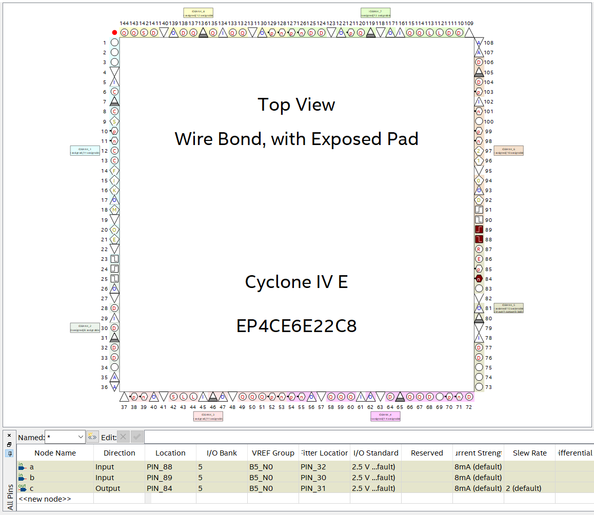
 
<figcaption>Fuente: Autor</figcaption>

Posteriormente a la correcta asignación de pines se debe compilar nuevamente al 100% el proyecto, para así finalmente programar el FPGA a través de la conexión JTAG en Tools>Programmer y en la opción "Hardware Setup" seleccionar USB-Blaster. Es importante resaltar que el archivo necesario para programar es el archivo .SOF que se encuentra en la carpeta outputs_files, la cual está dentro de la carpeta del proyecto.

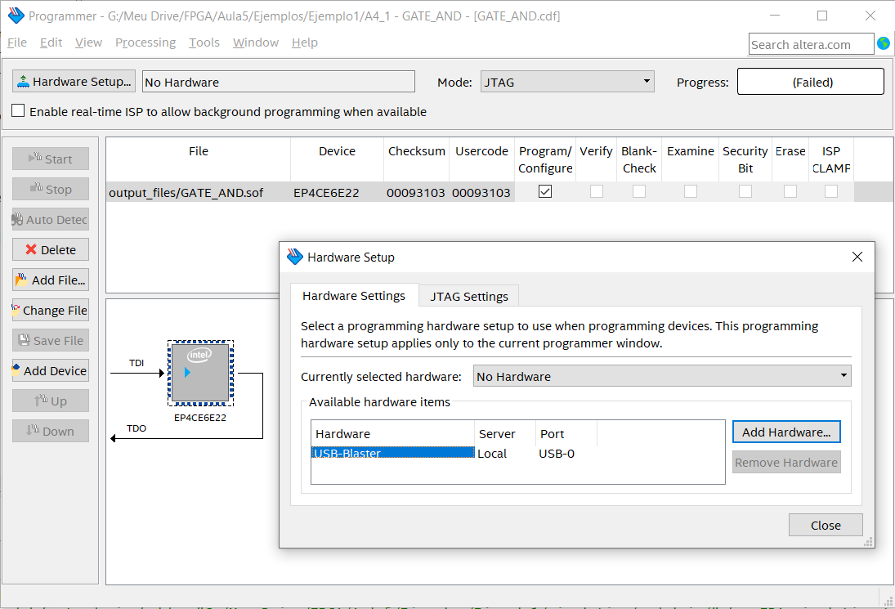
 
<figcaption>Fuente: Autor</figcaption>

Si Windows no reconoce el driver del programador USB Blaster se debe instalar el driver desde la carpeta de instalación de Quartus de la siguiente manera:

1. Abrir el administrador de dispositivos
2. Encontrar el driver en "otros dispositivos"
3. Actualizar el controlador desde un archivo en el PC 
4. Seleccionar la carpeta C:\intelFPGA_lite
5. Verificar que el driver aparezca en controladores USB

Finalmente, dar click en la opción start para comenzar la programación, la cual debe llegar a un progreso de 100%

<h3>Ejercicio</h3>

Modificar el tipo de compuerta AND a las siguientes compuertas y analizar el comportamiento en la tarjeta de desarrollo, teniendo en cuenta los diagramas esquemáticos del led y de los pulsadores:

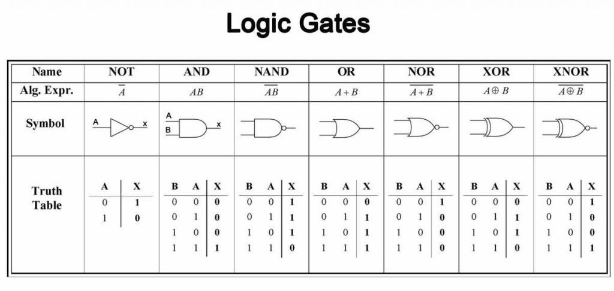
 
<figcaption>Fuente: http://muslimin.id/pengertian-logical-gate/</figcaption>

Como buena prática, antes de desconectar físicamente el USB del programador, se debe desconectar seleccionando "No Hardware" en Tools>Programmer y en la opción "Hardware Setup".

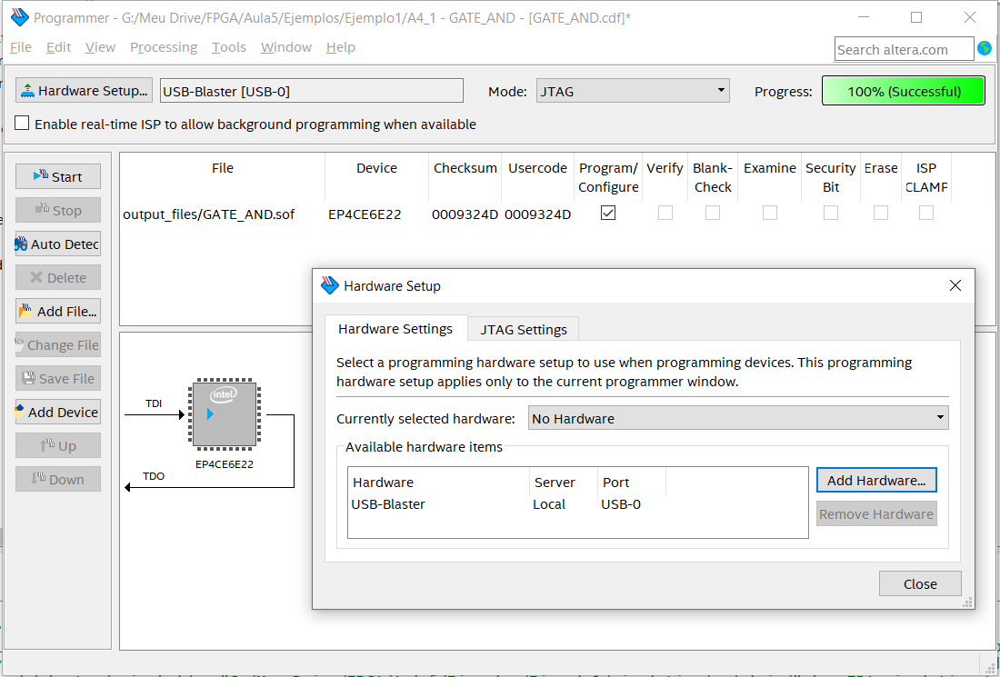
 
<figcaption>Fuente: http://muslimin.id/pengertian-logical-gate/</figcaption>

Si se desconecta la alimentación y se vuelve a conectar la alimentación en la tarjeta de desarrollo, es decir, si se apaga y se enciende la tarjeta de desarrollo, la última programación realizada anteriormente se pierde, por tanto se deben seguir estos pasos cada vez que se desee programar para garantizar que el programa quedará guardado en la memoria ROM EPCS16N de 16Mb:

1. Ir a File > Convert Programming Files y seleccionar en la opción "Programming file type" el formato .jic.

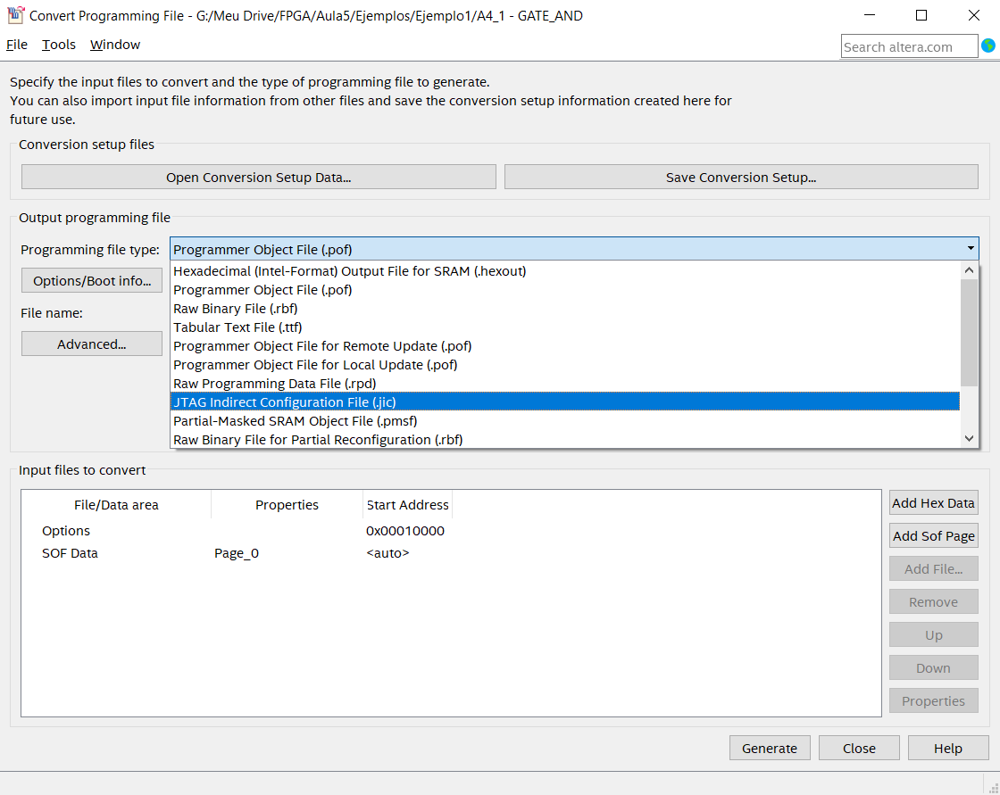
 
<figcaption>Fuente: Autor</figcaption>

2. Seleccionar en la opción "Configuration device" la referencia EPCS16

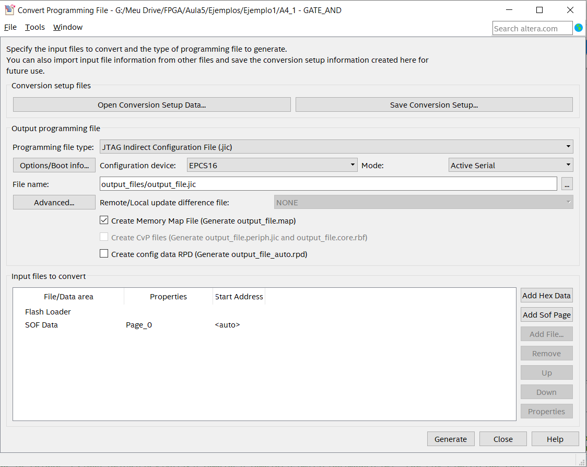
 
<figcaption>Fuente: Autor</figcaption>

3. Seleccionar "Flash Loader" y dar click en la opción "Add Device", para lo cual se debe seleccionar la familia Cyclone IV E de la serie EP4CE6.

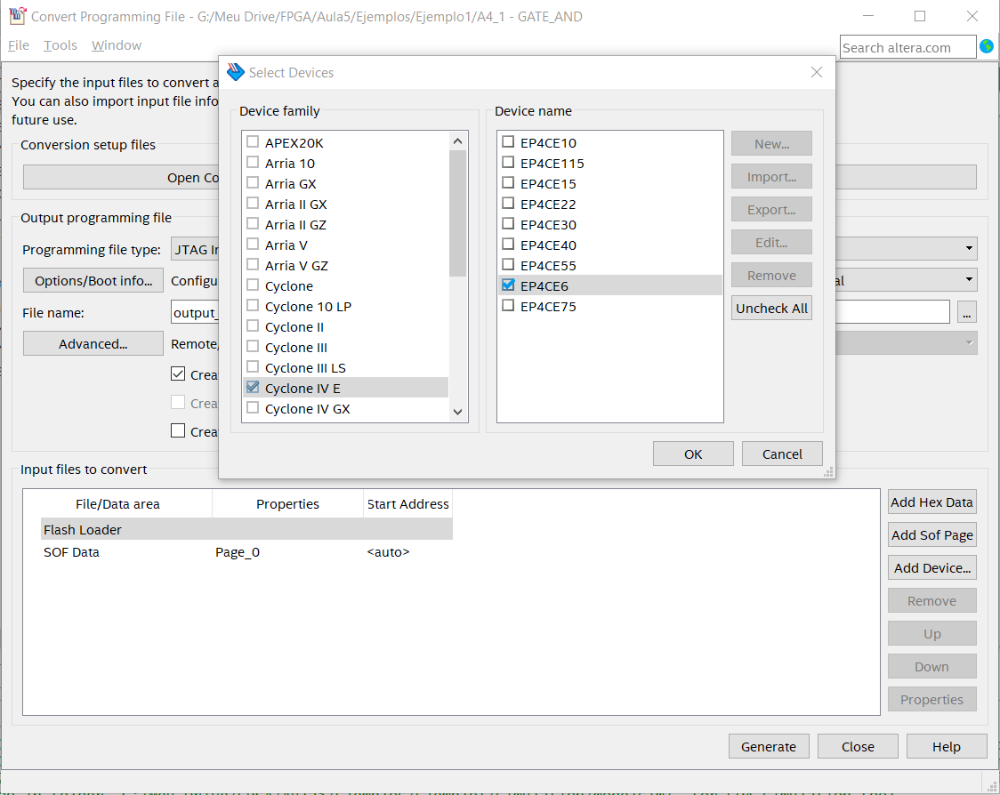
 
<figcaption>Fuente: Autor</figcaption>

4. Seleccionar "SOF Data", dar click en la opción "Add File" y seleccionar el archivo .SOF del proyecto.

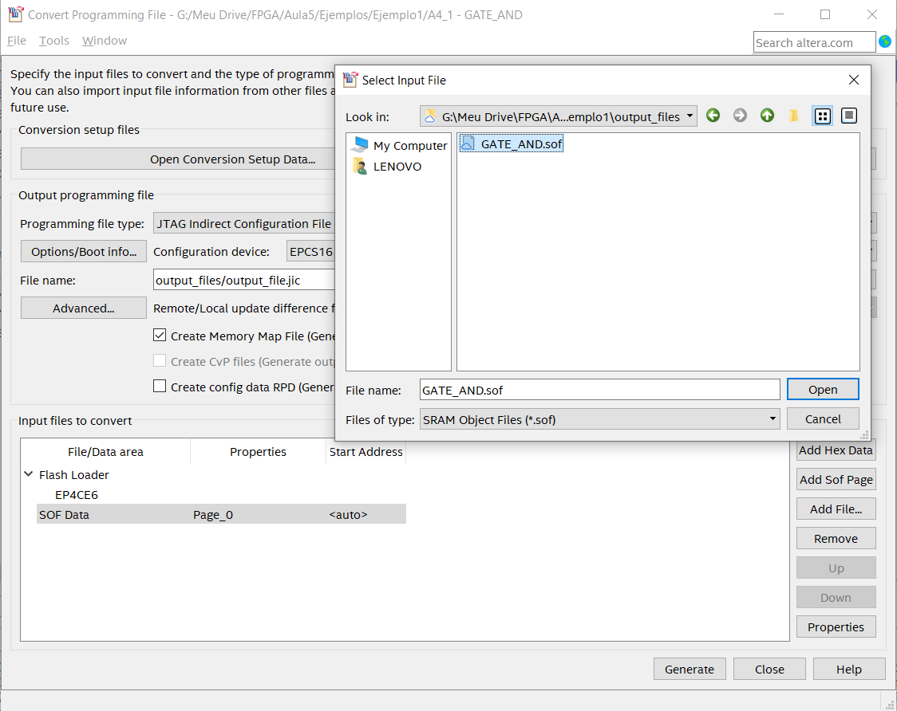
 
<figcaption>Fuente: Autor</figcaption>

5. Seleccionar el archivo .SOF, dar click en la opción "Properties" y marcar la casilla "Compression".

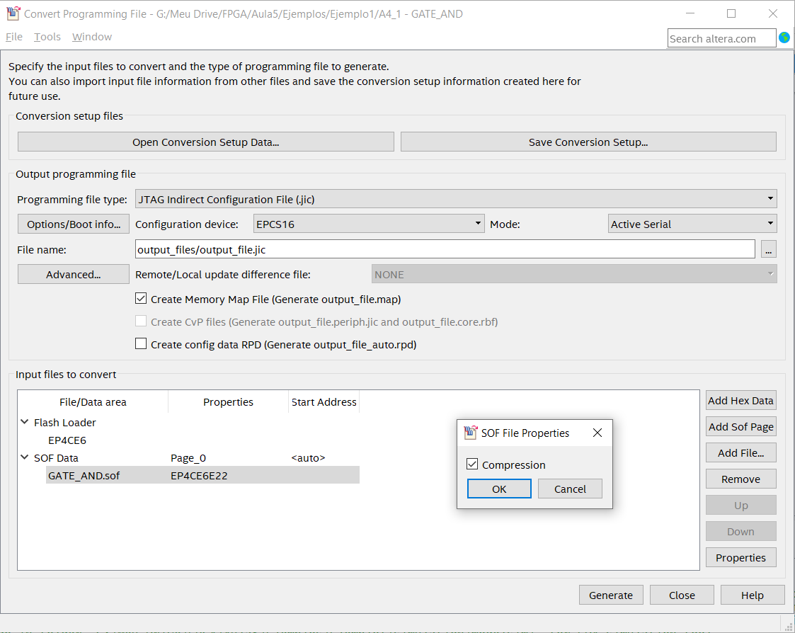
 
<figcaption>Fuente: Autor</figcaption>

6. Generar el archivo .jic, el cual se encontrará en la carpeta "outputs_files"

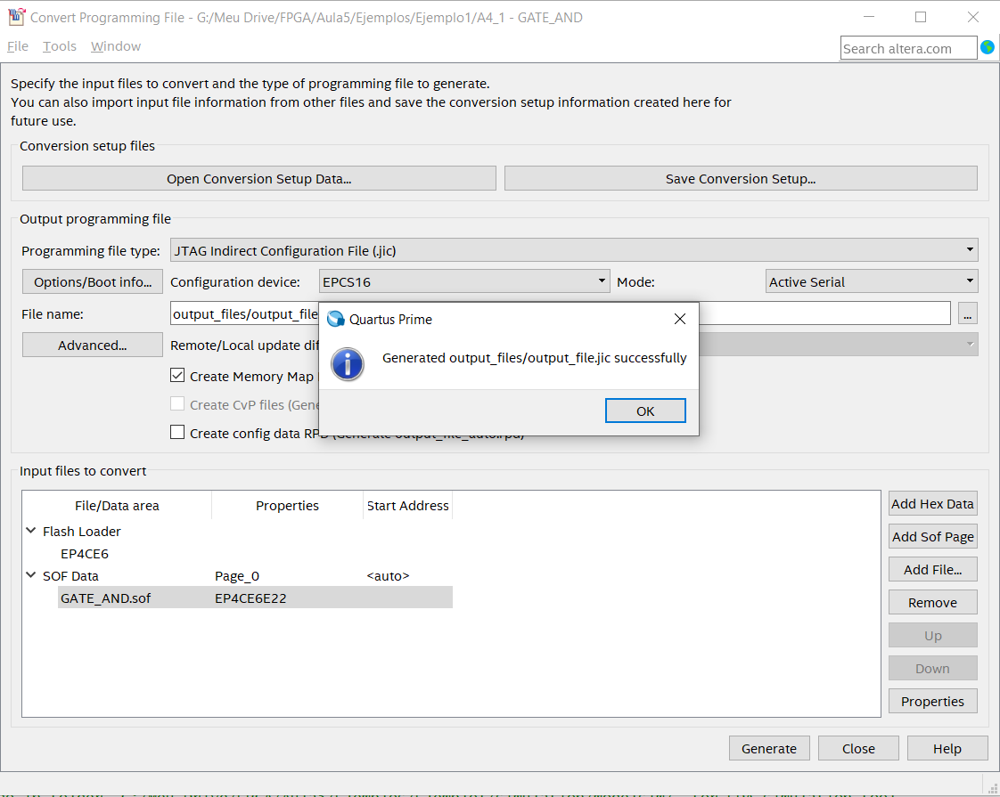
 
<figcaption>Fuente: Autor</figcaption>

7. Eliminar la configuración actual de programación con el archivo .sof en la herramienta de programación 

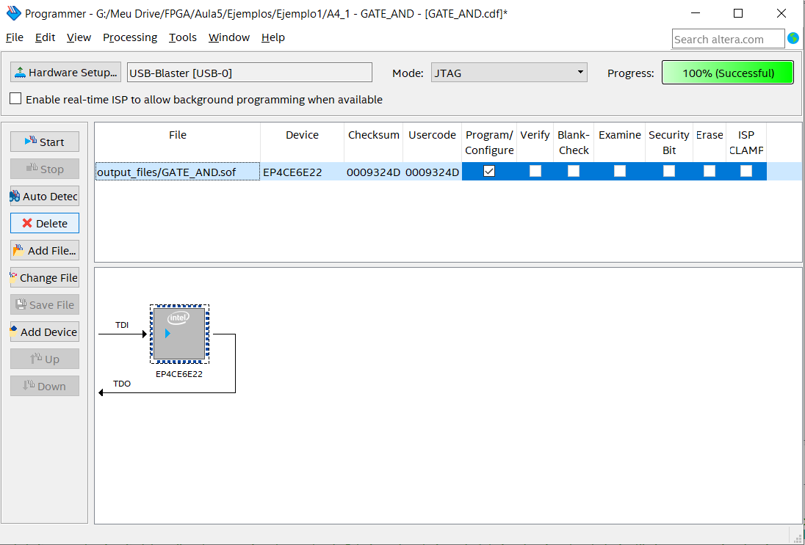
 
<figcaption>Fuente: Autor</figcaption>

8. Agregar la configuración de programación con el archivo .jic en la herramienta de programación 

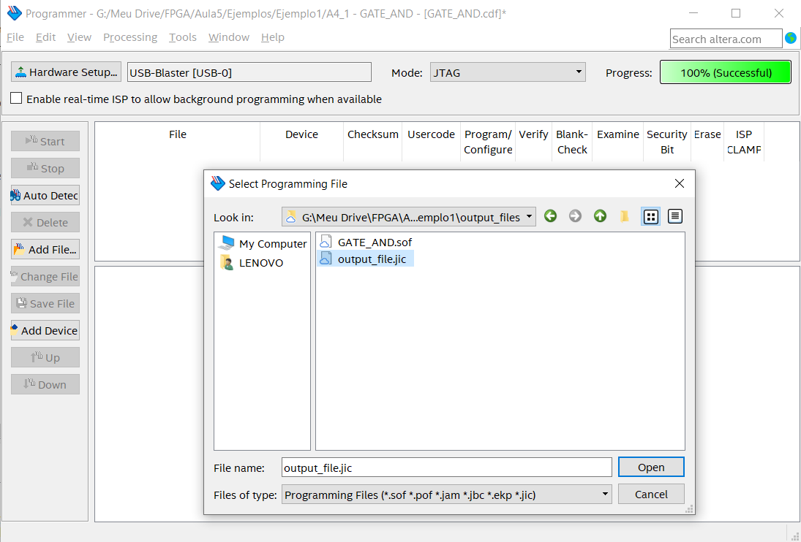
 
<figcaption>Fuente: Autor</figcaption>

9. Marcar la casilla "Program/Configure" en la nueva configuración de programación con el archivo .jic en la herramienta de programación 

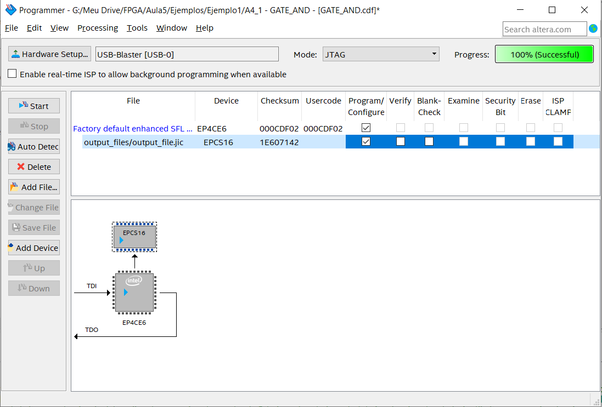
 
<figcaption>Fuente: Autor</figcaption>

Finalmente, para verificar que el programa haya quedado correctamente guardado en la memoria EPCS16N, se debe desconectar y conectar la alimentación de la tarjeta de desarrollo.